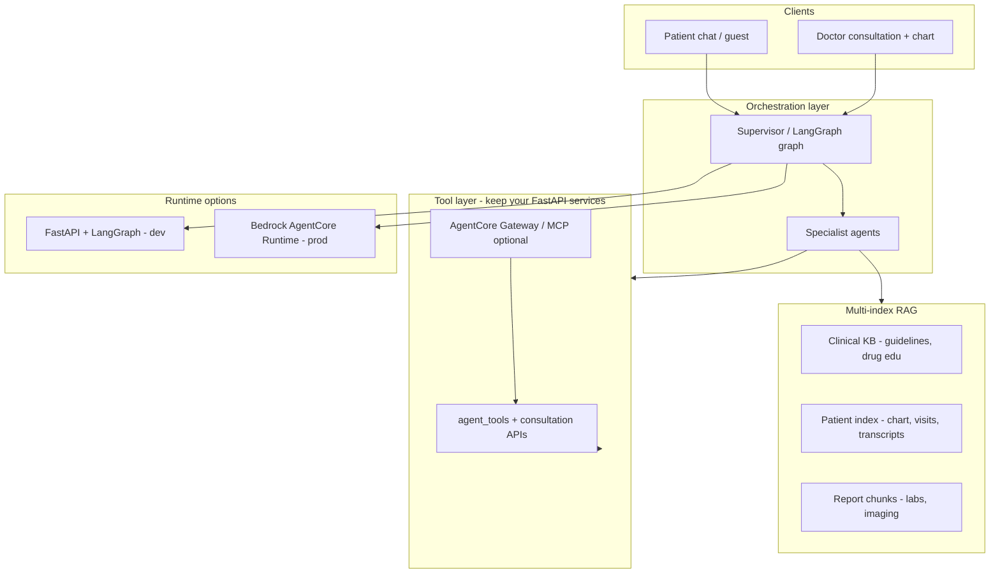

# Multi-Agent RAG & AWS AgentCore Plan

Plan for evolving MediAI from prompt + DB-tool agents to **grounded multi-agent RAG**, with an optional production path on **Amazon Bedrock AgentCore**.

---

## What you have today

| Layer | Current state |
|--------|----------------|
| **Orchestration** | `multi_agent/supervisor.py` routes to specialists (triage, scheduling, report, refill, etc.) |
| **Tools** | `agent_tools.py` — real DB actions (book, assess, meds, slots) |
| **Legacy path** | `dynamic_agent.py` still parallels the supervisor |
| **Doctor AI** | `consultation_ai_service.py` — LLM suggestions from intake + transcript (no RAG) |
| **Vector / graph** | `pgvector` + `langgraph` in `requirements.txt`, **not wired in code** |
| **Memory** | Redis session flow + `ConversationMemory` table — short-term, not semantic |
| **Knowledge** | Prompt-only medical policy (`healthcare_policy.py`) — no grounded corpus |

You are past “simple RAG chatbot” in **workflow** (booking, triage, reports), but **not yet** in **grounded retrieval** (guidelines, patient chart, report chunks, transcript history).

---

## Target architecture



**Principle:** Agents reason and act; RAG **feeds** agents with evidence — it does not replace them.

---

## Phased plan

### Phase 0 — Consolidate (2–3 weeks)

**Goal:** One brain, not three.

1. Make `multi_agent/supervisor.py` the **only** patient chat entry (retire `dynamic_agent` + legacy `ChatOrchestrator` path behind a feature flag).
2. Standardize on `AgentContext` + tool registry (`AGENT_TOOLS` in specialists).
3. Add **agent observability**: trace id per turn, specialist, tools called, latency, model — extend what you already do in `ConsultationAiAudit`.

**Why first:** Complex RAG on top of duplicate orchestrators creates unmaintainable mess.

---

### Phase 1 — Real multi-index RAG (4–6 weeks)

**Goal:** Retrieval that matters for healthcare, not “embed FAQ PDF.”

Use **pgvector** (you already run `pgvector/pgvector:pg16`) with **separate indexes**:

| Index | Sources | Used by |
|--------|---------|---------|
| **Clinical KB** | Curated guidelines (CDC/WHO excerpts, specialty playbooks, drug education) | `education_agent`, triage self-care |
| **Patient chart** | Meds, allergies, conditions, visit summaries, SOAP | `triage_agent`, `followup_agent`, doctor copilot |
| **Reports** | Chunked `Report.analysis_json` + uploaded PDF text | `report_agent` |
| **Transcripts** | `ConsultationTranscriptSession` (Phase 1 transcript work) | doctor copilot, follow-up agent |

**Retrieval pattern (agentic RAG, not naive):**

1. Supervisor picks specialist + **retrieval plan** (which indexes, filters).
2. Retrieve top-k with metadata filters (patient_id, date, source type).
3. Specialist gets **citations** in context (`source_id`, excerpt).
4. Tool calls still go through `agent_tools` for actions.

**Suggested new backend modules:**

```
backend/app/rag/
  embeddings.py      # Bedrock Titan / local model abstraction
  indexer.py         # chunk + upsert pipelines
  retriever.py       # multi-index query + rerank
  schemas.py         # RetrievedChunk, Citation
```

**Wire into existing agents:**

- `education_agent` → Clinical KB + citations in reply.
- `report_agent` → ReportRAG + existing report analysis.
- `triage_agent` → Patient chart + KB for self-care (with allergy cross-check).
- **New** `clinical_copilot_agent` (doctor-only) → chart + transcript + KB for in-visit assist (extends `consultation_ai_service`).

---

### Phase 2 — Complex multi-agent patterns (4–6 weeks)

**Goal:** Graph-based workflows + “agents as tools.”

Adopt **LangGraph** (already in deps) for:

| Workflow | Graph nodes |
|----------|-------------|
| **Triage → book** | gather → assess → self-care → (optional) handoff → scheduling |
| **Report discuss → book** | parse report → Q&A → specialist recommend → scheduling |
| **Doctor visit** | pre-visit RAG → live transcript monitor → draft SOAP → human approve |
| **Refill** | eligibility check → interaction check (KB) → request tool |

**Agents-as-tools** (AWS pattern, fits this codebase):

- Supervisor calls sub-agents as tools: `retrieve_evidence`, `assess_symptoms`, `draft_clinical_note`.
- Keeps specialists small; composes complex flows without mega-prompts.

**Handoffs** you already have (`handoff_to` in specialists) become **explicit graph edges** with persisted state in Redis/Postgres.

---

### Phase 3 — AWS Bedrock AgentCore (production lane, parallel to Phase 1–2)

**Goal:** Managed runtime, governance, scale — not a rewrite on day one.

| AgentCore component | Maps to this project |
|---------------------|----------------------|
| **AgentCore Runtime** | Host supervisor + doctor copilot graphs (Strands/LangGraph/Bedrock Agents) |
| **AgentCore Gateway** | Expose FastAPI tools as MCP/OpenAPI: `book_slot`, `assess_symptoms`, `get_transcript`, `search_guidelines` |
| **AgentCore Memory** | Long-horizon patient facts beyond Redis (visit outcomes, preferences) |
| **Managed KB / S3 Vectors** | Clinical KB at scale (optional upgrade from pgvector for guidelines corpus) |
| **AgentCore Policy + Guardrails** | PHI redaction, prompt injection at gateway, audit for HIPAA posture |
| **AgentCore Identity** | Tie to JWT/Cognito when moving off dev auth |

**Recommended split (hybrid):**

```
FastAPI (this repo)     →  source of truth: DB, appointments, transcripts, auth
AgentCore Runtime       →  heavy agent loops, multi-step reasoning, tool orchestration
AgentCore Gateway       →  secure tool boundary into FastAPI
```

Start with **one pilot agent on AgentCore**: doctor **Clinical Copilot** (transcript + chart RAG + suggest SOAP). Patient chat stays in FastAPI until stable, then migrate supervisor.

**AWS references:**

- [Building healthcare agents with AgentCore](https://aws.amazon.com/blogs/machine-learning/building-health-care-agents-using-amazon-bedrock-agentcore/)
- [sample-bedrock-agentcore-healthcare-s3vectors](https://github.com/aws-samples/sample-bedrock-agentcore-healthcare-s3vectors) — multi-agent + vector search pattern
- [Healthcare/Life Sciences agent guides](https://aws-samples.github.io/amazon-bedrock-agents-healthcare-lifesciences/guides/) — AgentCore Template vs FAST for prod UI

---

### Phase 4 — Product-facing “complex” features (pick 2–3)

These justify the investment vs simple RAG:

1. **Doctor Clinical Copilot** — live + pre-visit: cited differential, SOAP draft, lab suggestions (human-in-the-loop).
2. **Evidence-based patient education** — answers with guideline citations, not hallucinated advice.
3. **Report intelligence agent** — multi-step: abnormal values → guideline → specialist → book.
4. **Visit continuity agent** — post-visit: transcript summary + follow-up questions + refill eligibility.
5. **(Stretch) Prior-auth style demo** — retrieve policy + clinical evidence from chart (AgentCore Policy showcase).

---

## What NOT to build

- Single global vector store over “all documents”
- RAG-only chat with no tools (you already exceed that)
- Replacing `agent_tools` with pure LLM reasoning
- AgentCore migration before tool APIs are clean and traced
- Third orchestration path alongside supervisor + LangGraph

---

## Suggested task breakdown

| ID | Task | Depends on |
|----|------|------------|
| A0.1 | Feature-flag: supervisor-only chat path | — |
| A0.2 | Unified tool registry + audit logging | A0.1 |
| R1.1 | `rag` module + embedding pipeline | — |
| R1.2 | Clinical KB ingest (seed corpus) | R1.1 |
| R1.3 | Patient + report + transcript indexers | R1.1 |
| R1.4 | `retrieve_evidence` tool for specialists | R1.2–R1.3 |
| R1.5 | Citations in chat UI | R1.4 |
| G2.1 | LangGraph for triage→book workflow | A0.2 |
| G2.2 | Doctor copilot graph (chart + transcript RAG) | R1.4 |
| AWS3.1 | OpenAPI tool spec for Gateway | A0.2 |
| AWS3.2 | AgentCore Runtime pilot (doctor copilot) | AWS3.1, G2.2 |
| AWS3.3 | Guardrails + Policy on gateway | AWS3.2 |

---

## Recommended starting point

**Week 1–2:** Phase 0 + `rag/retriever.py` with **one index** (patient chart chunks from data you already have).

**Week 3–4:** Wire `education_agent` + `report_agent` to retrieval with citations.

**Week 5+:** LangGraph for doctor copilot; parallel AgentCore Gateway POC exposing 5–8 FastAPI tools.

That path upgrades from “prompt + DB tools” to **grounded multi-agent RAG** without throwing away `multi_agent/supervisor.py`, and gives a clean on-ramp to **AgentCore** for regulated production.

---

## Key codebase paths (reference)

| Area | Path |
|------|------|
| Multi-agent supervisor | `backend/app/multi_agent/supervisor.py` |
| Specialists | `backend/app/multi_agent/specialists.py` |
| Agent tools | `backend/app/services/agent_tools.py` |
| Legacy dynamic agent | `backend/app/dynamic_agent.py` |
| Doctor consultation AI | `backend/app/services/consultation_ai_service.py` |
| Transcript service | `backend/app/services/consultation_transcript_service.py` |
| Healthcare policy / guardrails | `backend/app/healthcare_policy.py` |
| Chat entry | `backend/app/routes/chat.py`, `backend/app/services/chat_orchestrator.py` |
