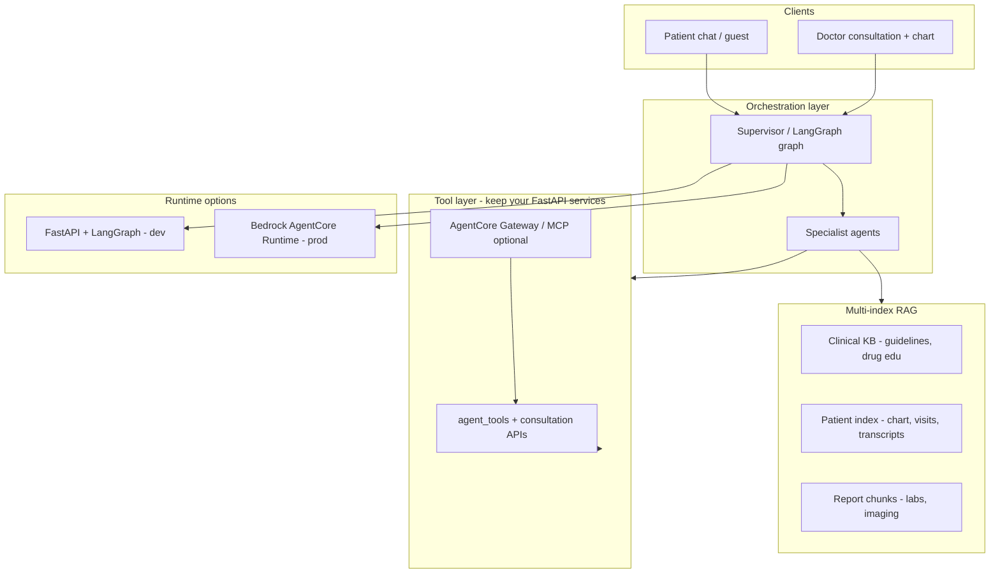

# Multi-Agent RAG & AWS AgentCore Plan

Plan for evolving MediAI from prompt + DB-tool agents to **grounded multi-agent RAG**, with an optional production path on **Amazon Bedrock AgentCore**.

---

## What you have today


| Layer              | Current state                                                                                |
| ------------------ | -------------------------------------------------------------------------------------------- |
| **Orchestration**  | `multi_agent/supervisor.py` routes to specialists (triage, scheduling, report, refill, etc.) |
| **Tools**          | `agent_tools.py` — real DB actions (book, assess, meds, slots)                               |
| **Legacy path**    | `dynamic_agent.py` still parallels the supervisor                                            |
| **Doctor AI**      | `consultation_ai_service.py` — LLM suggestions from intake + transcript (no RAG)             |
| **Vector / graph** | `pgvector` + `langgraph` in `requirements.txt`, **not wired in code**                        |
| **Memory**         | Redis session flow + `ConversationMemory` table — short-term, not semantic                   |
| **Knowledge**      | Prompt-only medical policy (`healthcare_policy.py`) — no grounded corpus                     |


You are past “simple RAG chatbot” in **workflow** (booking, triage, reports), but **not yet** in **grounded retrieval** (guidelines, patient chart, report chunks, transcript history).

---

## Target architecture




**Principle:** Agents reason and act; RAG **feeds** agents with evidence — it does not replace them.

---

## Phased plan

### Phase 0 — Consolidate (2–3 weeks)

**Goal:** One brain, not three.

1. Make `multi_agent/supervisor.py` the **only** patient chat entry (retire `dynamic_agent` + legacy `ChatOrchestrator` path behind a feature flag).
2. Standardize on `AgentContext` + tool registry (`AGENT_TOOLS` in specialists).
3. Add **agent observability**: trace id per turn, specialist, tools called, latency, model — extend what you already do in `ConsultationAiAudit`.

**Why first:** Complex RAG on top of duplicate orchestrators creates unmaintainable mess.

---

### Phase 1 — Real multi-index RAG (4–6 weeks)

**Goal:** Retrieval that matters for healthcare, not “embed FAQ PDF.”

Use **pgvector** (you already run `pgvector/pgvector:pg16`) with **separate indexes**:


| Index             | Sources                                                                    | Used by                                          |
| ----------------- | -------------------------------------------------------------------------- | ------------------------------------------------ |
| **Clinical KB**   | Curated guidelines (CDC/WHO excerpts, specialty playbooks, drug education) | `education_agent`, triage self-care              |
| **Patient chart** | Meds, allergies, conditions, visit summaries, SOAP                         | `triage_agent`, `followup_agent`, doctor copilot |
| **Reports**       | Chunked `Report.analysis_json` + uploaded PDF text                         | `report_agent`                                   |
| **Transcripts**   | `ConsultationTranscriptSession` (Phase 1 transcript work)                  | doctor copilot, follow-up agent                  |


**Retrieval pattern (agentic RAG, not naive):**

1. Supervisor picks specialist + **retrieval plan** (which indexes, filters).
2. Retrieve top-k with metadata filters (patient_id, date, source type).
3. Specialist gets **citations** in context (`source_id`, excerpt).
4. Tool calls still go through `agent_tools` for actions.

**Suggested new backend modules:**

```
backend/app/rag/
  embeddings.py      # Gemini / OpenAI / local model abstraction (Bedrock optional)
  indexer.py         # chunk + upsert pipelines
  retriever.py       # multi-index query + rerank
  schemas.py         # RetrievedChunk, Citation
```

**Wire into existing agents:**

- `education_agent` → Clinical KB + citations in reply.
- `report_agent` → ReportRAG + existing report analysis.
- `triage_agent` → Patient chart + KB for self-care (with allergy cross-check).
- **New** `clinical_copilot_agent` (doctor-only) → chart + transcript + KB for in-visit assist (extends `consultation_ai_service`).

---

### Phase 2 — Complex multi-agent patterns (4–6 weeks)

**Goal:** Graph-based workflows + “agents as tools.”

Adopt **LangGraph** (already in deps) for:


| Workflow                  | Graph nodes                                                          |
| ------------------------- | -------------------------------------------------------------------- |
| **Triage → book**         | gather → assess → self-care → (optional) handoff → scheduling        |
| **Report discuss → book** | parse report → Q&A → specialist recommend → scheduling               |
| **Doctor visit**          | pre-visit RAG → live transcript monitor → draft SOAP → human approve |
| **Refill**                | eligibility check → interaction check (KB) → request tool            |


**Agents-as-tools** (AWS pattern, fits this codebase):

- Supervisor calls sub-agents as tools: `retrieve_evidence`, `assess_symptoms`, `draft_clinical_note`.
- Keeps specialists small; composes complex flows without mega-prompts.

**Handoffs** you already have (`handoff_to` in specialists) become **explicit graph edges** with persisted state in Redis/Postgres.

---

### Phase 3 — AWS Bedrock AgentCore (production lane, parallel to Phase 1–2)

**Goal:** Managed runtime, governance, scale — not a rewrite on day one.


| AgentCore component               | Maps to this project                                                                                       |
| --------------------------------- | ---------------------------------------------------------------------------------------------------------- |
| **AgentCore Runtime**             | Host supervisor + doctor copilot graphs (Strands/LangGraph/Bedrock Agents)                                 |
| **AgentCore Gateway**             | Expose FastAPI tools as MCP/OpenAPI: `book_slot`, `assess_symptoms`, `get_transcript`, `search_guidelines` |
| **AgentCore Memory**              | Long-horizon patient facts beyond Redis (visit outcomes, preferences)                                      |
| **Managed KB / S3 Vectors**       | Clinical KB at scale (optional upgrade from pgvector for guidelines corpus)                                |
| **AgentCore Policy + Guardrails** | PHI redaction, prompt injection at gateway, audit for HIPAA posture                                        |
| **AgentCore Identity**            | Tie to JWT/Cognito when moving off dev auth                                                                |


**Recommended split (hybrid):**

```
FastAPI (this repo)     →  source of truth: DB, appointments, transcripts, auth
AgentCore Runtime       →  heavy agent loops, multi-step reasoning, tool orchestration
AgentCore Gateway       →  secure tool boundary into FastAPI
```

Start with **one pilot agent on AgentCore**: doctor **Clinical Copilot** (transcript + chart RAG + suggest SOAP). Patient chat stays in FastAPI until stable, then migrate supervisor.

**AWS references:**

- [Building healthcare agents with AgentCore](https://aws.amazon.com/blogs/machine-learning/building-health-care-agents-using-amazon-bedrock-agentcore/)
- [sample-bedrock-agentcore-healthcare-s3vectors](https://github.com/aws-samples/sample-bedrock-agentcore-healthcare-s3vectors) — multi-agent + vector search pattern
- [Healthcare/Life Sciences agent guides](https://aws-samples.github.io/amazon-bedrock-agents-healthcare-lifesciences/guides/) — AgentCore Template vs FAST for prod UI

---

### Phase 4 — Product-facing “complex” features (pick 2–3)

These justify the investment vs simple RAG:

1. **Doctor Clinical Copilot** — live + pre-visit: cited differential, SOAP draft, lab suggestions (human-in-the-loop).
2. **Evidence-based patient education** — answers with guideline citations, not hallucinated advice.
3. **Report intelligence agent** — multi-step: abnormal values → guideline → specialist → book.
4. **Visit continuity agent** — post-visit: transcript summary + follow-up questions + refill eligibility.
5. **(Stretch) Prior-auth style demo** — retrieve policy + clinical evidence from chart (AgentCore Policy showcase).

---

## Detailed explanations: how each part improves the existing system

This section explains **what each plan item does**, **how it works in your codebase**, and **what improves** compared to today.

### Current baseline (the gap)

Today MediAI is strong at **doing things** (book appointments, assess symptoms, analyze reports via tools) but weak at **knowing things with proof**:


| Today                             | Limitation                                                                          |
| --------------------------------- | ----------------------------------------------------------------------------------- |
| `healthcare_policy.py`            | Static prompt text — not searchable, not citable, not patient-specific              |
| `patient_context` loaded per turn | Full chart dumped into prompt — token-heavy, no relevance ranking                   |
| `consultation_ai_service.py`      | Uses intake + transcript text directly — no retrieval of prior visits or guidelines |
| `ConversationMemory`              | Short fact strings — not semantic search across history                             |
| `dynamic_agent.py` + supervisor   | Two orchestration paths — inconsistent behavior, hard to debug                      |
| `handoff_to` in specialists       | Implicit JSON field — state can be lost between turns                               |
| No vector search wired            | pgvector installed but unused — no grounded answers                                 |


The plan closes this gap **without replacing** your tools, booking flows, or doctor portal.

---

### Phase 0 — Consolidate orchestration

#### A0.1 — `USE_SUPERVISOR_ONLY` feature flag

**What it is:** An environment switch that forces all patient chat through `multi_agent/supervisor.py` and skips `dynamic_agent.py` and legacy `ChatOrchestrator` fallbacks.

**How it works today:** `chat_orchestrator.py` calls the supervisor, but `agents.py` still has `ChatOrchestrator` and `dynamic_agent.py` has ~1300 lines of parallel routing, booking, and triage logic. Some code paths may still hit the old agent.

**Improvement:**

- One routing brain → predictable specialist selection (triage vs scheduling vs report)
- Easier to add RAG hooks in one place (supervisor + specialists) instead of three
- Safer rollout: flag off = old behavior; flag on = new path for testing

---

#### A0.2 — Unified chat routing

**What it is:** Audit and fix every entry point (patient login chat, guest chat, quick actions, report follow-up) so they all pass the same context to the supervisor.

**How it works today:** Guest chat uses `GUEST_PATIENT_CTX` stub; patient chat loads full `patient_context`. Report uploads pass `report_id` on some paths only.

**Improvement:**

- Guest and logged-in patients get consistent triage/education quality
- Report agent always receives `report_id` when discussing a lab result
- No “works in patient portal but not on landing page” bugs

---

#### A0.3 — Centralized tool registry

**What it is:** Move `AGENT_TOOLS` from `specialists.py` into `tool_registry.py` with validation so each specialist can only call allowed tools.

**How it works today:** Tools are listed in `AGENT_TOOLS` dict; `execute_agent_tool` in `agent_tools.py` runs DB actions. No central audit or guard if LLM requests a wrong tool.

**Improvement:**

- **Safety:** scheduling agent cannot accidentally call `request_refill`
- **Observability:** single hook to log every tool call before/after execution
- **RAG integration:** `retrieve_evidence` registers once and is granted per agent type

---

#### A0.4 — `AgentTurnAudit` trace logging

**What it is:** A database table (like `ConsultationAiAudit` for doctor AI) that records every chat turn: trace ID, which specialist ran, which tools were called, latency, model used.

**How it works today:** Doctor consultation AI has audit rows; patient chat has no equivalent structured log. Debugging “why did it book instead of triage?” requires reading raw logs.

**Improvement:**

- Replay any conversation turn for debugging
- Measure specialist accuracy and tool success rates
- Required foundation before AgentCore (production agents need audit trails)
- Supports compliance demos: show what the AI accessed and did

---

#### A0.5 — Smoke tests with flag on

**What it is:** Manual or automated verification that triage, booking, report, refill, and guest flows still work after consolidation.

**Improvement:** Prevents Phase 0 from breaking existing demo flows before RAG is added.

---

### Phase 1 — Multi-index RAG

#### R1.1–R1.3 — RAG module, vector tables, embeddings

**What it is:** New `backend/app/rag/` package that embeds text chunks into PostgreSQL pgvector and retrieves similar chunks by semantic search.

**How it works today:** PostgreSQL has `vector` extension (migration `001_initial_schema.py`) but no application code uses it. LLM context is built by dumping full patient context or full report JSON into the prompt.

**Improvement:**

- **Relevance:** Only the 5 most related chunks go into the prompt, not the entire chart
- **Cost:** Fewer tokens per LLM call → lower API cost and faster responses
- **Accuracy:** Model focuses on allergy list when question is about medication, not buried in 2KB of context

**Embedding providers:** Gemini/OpenAI/local — matches your existing `LLM_PROVIDER` pattern; no AWS required.

---

#### R1.4 — Patient chart index

**What it is:** Index structured patient data as searchable chunks: medications, allergies, conditions, visit summaries.

**Sources:** `patient_context.py`, Patient model, visit records.

**Used by:** `triage_agent`, `followup_agent`, doctor copilot.

**How it works today:** `patient_ctx_for_llm()` serializes the whole chart into every specialist prompt. Allergies may be ignored if the prompt is long or the model attention drifts.

**Improvement:**

- Triage asks “can I take ibuprofen?” → retrieval surfaces **allergy chunk first** with high score
- Follow-up agent recalls **last visit summary** without re-querying all tables
- Doctor copilot sees **relevant chart slice** per question during video consult

---

#### R1.5 — `retrieve_evidence` tool

**What it is:** A new agent tool callable by specialists: input = query + index types + patient_id; output = ranked chunks with citations.

**How it works today:** Agents call `assess_symptoms`, `book_slot`, etc. — all **action** tools. No **knowledge** tool.

**Improvement:**

- Supervisor/specialist explicitly **decides when to search** (agentic RAG vs blind retrieval every turn)
- Same tool used by patient agents and doctor copilot — one retrieval API
- Results include `source_id` for citations in UI

---

#### R1.6 — Wire `triage_agent`

**What it is:** Before triage LLM generates a reply, call `retrieve_evidence` on patient chart (+ clinical KB for self-care). Inject chunks into prompt. Cross-check allergies against suggested self-care.

**How it works today:** `triage_agent` uses `self_care_service` and `assess_symptoms` tool; patient allergies are in prompt but not enforced structurally.

**Improvement:**

- Patient with penicillin allergy gets self-care advice that **never suggests penicillin-class drugs**
- Triage cites **patient's own allergy list** as source — trust and transparency
- Reduces hallucinated self-care that contradicts chart data

---

#### R1.7 — Clinical KB index

**What it is:** Curated seed corpus (20–50 chunks) from guideline excerpts: fever care, diabetes basics, drug education.

**How it works today:** `education_agent` uses `HEALTH_QA_PROMPT` — model answers from training data only. No source attribution.

**Improvement:**

- “What helps with a fever?” → answer cites **CDC excerpt** shown to user
- Reduces fabricated medical advice — critical for healthcare liability
- Content team can update KB files without changing prompt code

---

#### R1.8–R1.10 — Report index + `report_agent`

**What it is:** Chunk `Report.analysis_json` and PDF extracted text into vectors. Report agent retrieves relevant chunks when patient asks about specific values.

**How it works today:** `report_agent` calls `get_report_analysis` — returns full structured JSON. Patient asks “what does my hemoglobin mean?” — entire analysis goes to LLM.

**Improvement:**

- Precise answers about **one analyte** without noise from unrelated results
- Citations point to **patient's actual report** — “Your result: 9.2 g/dL (ref: 12–16)”
- Enables Phase 4 report intelligence (abnormal → guideline → book)

---

#### R1.11–R1.14 — Citations API + UI

**What it is:** Standard `Citation` schema in API responses; frontend chips showing source title + expandable excerpt.

**How it works today:** Chat returns `reply` text only. Doctor AI returns structured JSON but no linked sources.

**Improvement:**

- Patients and doctors see **where information came from**
- Demo/stakeholder value: visibly “grounded” AI vs generic ChatGPT
- Foundation for regulatory conversations (auditability)

---

#### R1.12–R1.13 — Transcript index + `followup_agent`

**What it is:** Index `ConsultationTranscriptSession` segments when consult ends. Follow-up agent retrieves prior visit dialogue.

**How it works today:** Transcript capture exists (`consultation_transcript_service.py`, Deepgram, `TranscriptPanel.tsx`) but is used for in-visit display and `consultation_ai_service` — not for post-visit patient chat.

**Improvement:**

- Post-visit: “How are your headaches?” references **what patient said in video call**
- Continuity across channels: video consult → chat follow-up uses same indexed memory
- Doctor copilot searches prior transcript segments semantically (“did patient mention chest pain?”)

---

#### R1.15 — Reindex admin endpoint

**What it is:** Dev/admin API to rebuild indexes after data changes or KB updates.

**Improvement:** Operational control — reindex one patient or full clinical KB without redeploying.

---

### Phase 2 — LangGraph multi-agent workflows

#### G2.1 — LangGraph setup + checkpointer

**What it is:** Replace implicit session dict juggling with explicit graphs whose state persists in Redis/Postgres between turns.

**How it works today:** `ctx.session` in supervisor holds `active_specialist`, booking state, triage symptoms — complex merging in `booking_actions.py` (~2000 lines). State can desync if handoff fails mid-flow.

**Improvement:**

- **Resumable flows:** patient leaves and returns — graph state restores exact step
- **Visualizable:** graph nodes map to product steps (debug triage stuck on step 3)
- **Testable:** each node unit-tested independently

---

#### G2.2 — Triage → book graph

**Nodes:** gather symptoms → assess → self-care (+ RAG) → optional handoff → scheduling.

**How it works today:** Triage and booking interact via `handoff_to: scheduling_agent` and `resolve_booking_session` — works but logic spread across `specialists.py` and `booking_actions.py`.

**Improvement:**

- Enforces clinical path: **assess before book** — scheduling cannot run until graph edge allows
- Self-care step always runs RAG-backed advice before offering doctor
- Clearer UX: product team can show “Step 2 of 4: Self-care advice”

---

#### G2.3 — Report → book graph

**Nodes:** parse report → Q&A with citations → recommend specialist → offer booking.

**How it works today:** Report discussion and booking are separate intents; patient must manually ask to book after report chat.

**Improvement:**

- Abnormal liver enzymes → explains result → cites guideline → suggests gastroenterologist → **one-tap book**
- Converts report upload from “PDF viewer + chat” into **actionable care pathway**

---

#### G2.4 — Refill graph

**Nodes:** eligibility → drug interaction KB check → submit refill.

**How it works today:** `refill_agent` calls `get_medications` and `request_refill` — no interaction checking against clinical KB.

**Improvement:**

- New med + existing med interaction flagged **before** refill request sent to doctor
- Safer medication workflows — reduces obvious adverse interaction misses

---

#### G2.5 — Agents-as-tools

**What it is:** Supervisor invokes sub-agents (`retrieve_evidence`, `assess_symptoms`, `draft_clinical_note`) as tools instead of stuffing all logic into one prompt.

**How it works today:** Each specialist is a monolithic class with prompt + tool loop in `BaseSpecialist.run()`.

**Improvement:**

- Smaller, focused prompts per sub-task → better LLM accuracy
- Composable: doctor copilot calls `retrieve_evidence` + `draft_clinical_note` in sequence
- Matches AWS AgentCore pattern — eases Phase 3 migration

---

#### G2.6–G2.8 — Clinical copilot + doctor visit graph + video integration

**What it is:** Doctor-only agent (not patient supervisor) that runs a LangGraph: pre-visit RAG → monitor live transcript → draft SOAP → doctor approves. Hooked to `ConsultationSession.tsx` and `useConsultationTranscript`.

**How it works today:** `consultation_ai_service.py` generates suggestions from intake + full transcript text on demand. No graph state, no prior visit retrieval, no structured approve workflow.

**Improvement:**


| Capability      | Today                   | After                                      |
| --------------- | ----------------------- | ------------------------------------------ |
| Pre-visit prep  | Intake form only        | RAG over chart + prior visits + guidelines |
| In-visit assist | Manual refresh          | Auto-update on new transcript segments     |
| SOAP draft      | Unstructured suggestion | Structured S/O/A/P with citations          |
| Doctor control  | Suggestions only        | Accept / edit / reject before save         |
| Evidence        | None cited              | Links to chart, transcript, KB             |


This is the **highest-value doctor-facing feature** in the plan and leverages your existing LiveKit + Deepgram investment.

---

### Phase 3 — AWS Bedrock AgentCore

#### AWS3.1–AWS3.2 — OpenAPI spec + FastAPI wrapper routes

**What it is:** Expose existing `agent_tools` as documented HTTP endpoints (`/agent-tools/book_slot`, etc.) with service-key auth for external agent runtimes.

**How it works today:** Tools are Python functions called internally only.

**Improvement:**

- AgentCore (or any external agent) can call your DB/actions **without duplicating business logic**
- FastAPI remains **source of truth** — appointments, patients, transcripts stay in your Postgres
- Clean boundary for security review: what external agents can vs cannot do

---

#### AWS3.3 — AgentCore Gateway POC

**What it is:** AWS-managed proxy that registers your OpenAPI spec and forwards tool calls to FastAPI.

**Improvement:**

- Built-in rate limiting, auth, and tool discovery for production agents
- MCP/OpenAPI support for multi-tool orchestration at scale

---

#### AWS3.4–AWS3.5 — Runtime pilot + E2E test

**What it is:** Run doctor copilot graph on AgentCore Runtime instead of in-process FastAPI. Video consult → transcript → Runtime → cited SOAP.

**How it works today:** All LLM + agent logic runs inside FastAPI worker — scales with API pods, no managed agent governance.

**Improvement:**

- **Scale:** heavy multi-step agent loops offloaded from API servers
- **Governance:** AWS audit, policy hooks for PHI
- **Hybrid:** patient chat stays local until proven; doctor copilot pilots on AWS first — low risk

**Not required for demo:** Phase 1–2 deliver full value without AWS account.

---

#### AWS3.6 — Guardrails sketch

**What it is:** PHI redaction on gateway logs, prompt injection filter on search inputs, trace ID alignment.

**Improvement:** Documents path to HIPAA-conscious production — not achievable in code alone but plan captures requirements.

---

### Phase 4 — Product-facing features

#### P4.1 — Doctor Clinical Copilot (polish)

**What it is:** Production UI for cited differential, editable SOAP, lab catalog matches, “Apply to note” — on top of G2.6–G2.8.

**Improvement over today:** `InVisitSummaryPanel` / `consultation_ai_service` suggestions become a **complete copilot workflow** doctors can trust and adopt.

---

#### P4.2 — Evidence-based patient education

**What it is:** Every education reply shows guideline citations; “Learn more” expands source.

**Improvement over today:** `education_agent` answers feel like **verified health library**, not generic chatbot — key differentiator for patient trust.

---

#### P4.3 — Report intelligence

**What it is:** UI highlights abnormals, auto-suggests specialist, one-click book, guideline per flag.

**Improvement over today:** Report upload flow ends at analysis JSON display — becomes **closed-loop care navigation**.

---

#### P4.4 — Visit continuity

**What it is:** Auto post-visit summary, timed follow-up questions, refill eligibility in `followup_agent`.

**Improvement over today:** Video consult and patient chat are **disconnected** after visit ends — this links them via transcript index + follow-up agent.

---

### What NOT to build (explained)


| Skip                           | Why                                                                                                               |
| ------------------------------ | ----------------------------------------------------------------------------------------------------------------- |
| Single global vector store     | Patient data + guidelines + reports mixed together → wrong retrieval (e.g. another patient's chunk), privacy risk |
| RAG-only chat without tools    | You already have booking, triage tools — RAG enhances, not replaces                                               |
| Replace `agent_tools` with LLM | LLM cannot book real slots or read real DB — tools stay mandatory                                                 |
| AgentCore before clean APIs    | Gateway needs stable OpenAPI + audit — Phase 0 first                                                              |
| Third orchestration path       | supervisor + LangGraph + dynamic_agent = unmaintainable                                                           |


---

### End-to-end: patient journey after full plan

```
1. Patient: "I have a headache and fever"
   → Supervisor → triage_agent
   → retrieve_evidence(patient chart + clinical KB)
   → Self-care with citations, allergy-safe
   → LangGraph: assess_symptoms node

2. Patient: "I want to see a doctor"
   → Graph handoff → scheduling_agent → book_slot tool
   → AgentTurnAudit logs full path

3. Video consult with doctor
   → Transcript indexed live
   → Clinical copilot: chart RAG + transcript RAG → SOAP draft
   → Doctor approves note

4. Next day: followup_agent
   → retrieve_evidence(prior transcript)
   → "How is your fever? Any side effects from advice we discussed?"
```

**vs today:** Steps 1–2 work without citations/allergy enforcement; step 3 has basic AI suggestions without RAG; step 4 does not exist as automated continuity.

---

### Priority order if time is limited


| Priority | Items                         | Why                                                       |
| -------- | ----------------------------- | --------------------------------------------------------- |
| **P0**   | A0.1–A0.4, R1.1–R1.6          | Foundation + safest patient impact (allergy-aware triage) |
| **P1**   | R1.7–R1.11, R1.14             | Citations + education + reports — visible demo value      |
| **P2**   | R1.12–R1.13, G2.6–G2.8        | Doctor copilot — leverages video/transcript work          |
| **P3**   | G2.2–G2.4                     | Graph workflows — reliability at scale                    |
| **P4**   | AWS3.x                        | Production lane when AWS ready                            |
| **P5**   | P4.3–P4.4, prior-auth stretch | Nice-to-have product polish                               |


---

- Single global vector store over “all documents”
- RAG-only chat with no tools (you already exceed that)
- Replacing `agent_tools` with pure LLM reasoning
- AgentCore migration before tool APIs are clean and traced
- Third orchestration path alongside supervisor + LangGraph

---

## Feasibility assessment

### Achievable (with current stack)

**Multi-agent (extend existing)**

- Consolidate orchestration — `chat_orchestrator.py` already uses `multi_agent_supervisor`; retire `dynamic_agent` / `ChatOrchestrator` behind a feature flag
- Add doctor-only `clinical_copilot_agent` wired to `consultation_ai_service.py` + transcript APIs
- Agents-as-tools — `retrieve_evidence`, `assess_symptoms`, `draft_soap` callable from supervisor
- Explicit handoff graphs — existing `handoff_to` in specialists → LangGraph nodes with Redis/Postgres state
- Observability — extend `ConsultationAiAudit` pattern (trace id, specialist, tools, latency)

**Multi-agent RAG**


| Index         | Existing data                                           | Wire to                                          |
| ------------- | ------------------------------------------------------- | ------------------------------------------------ |
| Patient chart | meds, allergies, conditions, visits (`patient_context`) | `triage_agent`, `followup_agent`, doctor copilot |
| Reports       | `Report.analysis_json`, PDF text (`report_service`)     | `report_agent`                                   |
| Transcripts   | `ConsultationTranscriptSession`                         | doctor copilot, `followup_agent`                 |
| Clinical KB   | new curated corpus (CDC/WHO excerpts, drug edu)         | `education_agent`, triage self-care              |


- `backend/app/rag/` module on **pgvector** (extension already in Alembic; deps present)
- Agentic retrieval: supervisor picks index + filters → top-k with citations → specialist prompt; actions via `agent_tools.py`
- Embeddings via Gemini/Groq-compatible API or local model — Bedrock Titan optional, not required
- Citations in API responses and chat UI

**LangGraph workflows**


| Workflow      | Nodes                                                          |
| ------------- | -------------------------------------------------------------- |
| Triage → book | gather → assess → self-care → (optional) handoff → scheduling  |
| Report → book | parse → Q&A → specialist recommend → scheduling                |
| Doctor visit  | pre-visit RAG → live transcript → draft SOAP → doctor approves |
| Refill        | eligibility → KB interaction check → refill tool               |


**AgentCore (hybrid, incremental)**

- FastAPI remains source of truth (DB, auth, appointments, transcripts, tools)
- Pilot: **Doctor Clinical Copilot** on AgentCore Runtime
- Gateway POC: 5–8 FastAPI tools as OpenAPI/MCP (`book_slot`, `assess_symptoms`, `get_transcript`, `search_guidelines`, etc.)
- Patient chat stays in FastAPI until supervisor + RAG are stable

**Product features (pick 2–3)**

1. Doctor Clinical Copilot — cited differential, SOAP draft, lab suggestions (human-in-the-loop)
2. Evidence-based patient education — guideline citations
3. Report intelligence — abnormal values → guideline → specialist → book
4. Visit continuity — post-visit summary, follow-up, refill eligibility

### Not achievable without major prerequisites

- **AgentCore Runtime / Gateway / Memory / Policy** as-is — requires AWS Bedrock + AgentCore account and config (not in current `.env`)
- **Bedrock Titan embeddings** as written — stack uses Gemini/Groq today
- **Managed KB / S3 Vectors** at scale — AWS-only; pgvector is the realistic path here
- **AgentCore Identity (Cognito)** — requires auth migration beyond dev JWT
- **Production HIPAA via AgentCore Policy** — AWS enterprise setup, not code-only
- **Prior-auth demo** — stretch; needs policy corpus + compliance work
- **Comprehensive clinical KB** — achievable as seed corpus only; full CDC/WHO library needs ongoing curation
- **Stated 2–6 week phase timelines** — optimistic unless dedicated team + curated content

**Bottom line:** Multi-index RAG + LangGraph multi-agent workflows can be built entirely in this repo. AgentCore is an optional production upgrade after doctor copilot and tool boundaries are proven.

---

## Implementation plan

### Overview


| Phase                       | Duration  | Outcome                                          |
| --------------------------- | --------- | ------------------------------------------------ |
| **0 — Consolidate**         | 2 weeks   | Single orchestrator, tool registry, audit traces |
| **1 — RAG foundation**      | 3–4 weeks | pgvector indexes, `retrieve_evidence`, citations |
| **2 — LangGraph workflows** | 3–4 weeks | Graph-based triage/book, doctor copilot graph    |
| **3 — AgentCore pilot**     | 2–3 weeks | Gateway + Runtime POC for doctor copilot         |
| **4 — Product features**    | 2–3 weeks | Ship 2–3 user-facing capabilities                |


Total: **~12–16 weeks** (can overlap Phase 2 + 3 after R1.4).

---

### Phase 0 — Consolidate orchestration (Weeks 1–2)

**Goal:** One brain, traced tool calls, clean extension points for RAG.


| ID   | Task                                            | Deliverable                                                     | Owner   |
| ---- | ----------------------------------------------- | --------------------------------------------------------------- | ------- |
| A0.1 | Add `USE_SUPERVISOR_ONLY` feature flag          | Env flag; `dynamic_agent` / `ChatOrchestrator` bypassed when on | Backend |
| A0.2 | Route all chat through `multi_agent_supervisor` | `chat_orchestrator.py` + guest paths unified                    | Backend |
| A0.3 | Centralize tool registry                        | Single `AGENT_TOOLS` + `execute_agent_tool` audit hook          | Backend |
| A0.4 | Agent turn audit table / log                    | `AgentTurnAudit`: trace_id, specialist, tools, latency, model   | Backend |
| A0.5 | Smoke tests for triage, book, report, refill    | Existing flows pass with flag on                                | QA      |


**Exit criteria:** Feature flag on in dev; no duplicate routing; every tool call logged with trace id.

---

### Phase 1 — Multi-index RAG (Weeks 2–6)

**Goal:** Grounded retrieval with citations; start patient chart, expand to KB + reports + transcripts.

#### Week 2–3: RAG module + patient index


| ID   | Task                                | Deliverable                                                                     |
| ---- | ----------------------------------- | ------------------------------------------------------------------------------- |
| R1.1 | Create `backend/app/rag/` package   | `embeddings.py`, `schemas.py`, `indexer.py`, `retriever.py`                     |
| R1.2 | Alembic migration for vector tables | `rag_chunks` table: embedding, content, metadata, index_type, patient_id        |
| R1.3 | Embedding provider abstraction      | Gemini / OpenAI / local sentence-transformers via env config                    |
| R1.4 | Patient chart indexer               | Chunk meds, allergies, conditions, visit summaries from `patient_context` + DB  |
| R1.5 | `retrieve_evidence` tool            | Args: `indexes[]`, `query`, `patient_id`, `filters`; returns `RetrievedChunk[]` |
| R1.6 | Wire `triage_agent`                 | Patient chart + allergy cross-check in self-care path                           |


#### Week 4–5: KB + reports


| ID    | Task                    | Deliverable                                                          |
| ----- | ----------------------- | -------------------------------------------------------------------- |
| R1.7  | Clinical KB seed ingest | 20–50 curated chunks (CDC/WHO excerpts, common conditions, drug edu) |
| R1.8  | Report indexer          | Chunk `Report.analysis_json` + extracted PDF text                    |
| R1.9  | Wire `education_agent`  | Clinical KB retrieval + citations in reply JSON                      |
| R1.10 | Wire `report_agent`     | ReportRAG + existing `get_report_analysis` tool                      |
| R1.11 | Citation schema in API  | `ui_payload.citations[]` with `source_id`, `title`, `excerpt`        |


#### Week 5–6: Transcripts + UI


| ID    | Task                         | Deliverable                                                          |
| ----- | ---------------------------- | -------------------------------------------------------------------- |
| R1.12 | Transcript indexer           | Index `ConsultationTranscriptSession` segments on consult end        |
| R1.13 | Wire `followup_agent`        | Prior visit transcript + chart for continuity                        |
| R1.14 | Citations in chat UI         | Patient chat + doctor portal show source chips / expandable excerpts |
| R1.15 | Reindex CLI / admin endpoint | `POST /admin/rag/reindex` for dev and seed refresh                   |


**Exit criteria:** Triage cites patient allergies; education cites KB; report Q&A cites report chunks; doctor sees transcript in copilot context.

---

### Phase 2 — LangGraph multi-agent workflows (Weeks 6–10)

**Goal:** Explicit graphs for complex flows; agents-as-tools; doctor copilot graph.


| ID   | Task                                   | Deliverable                                                                          |
| ---- | -------------------------------------- | ------------------------------------------------------------------------------------ |
| G2.1 | LangGraph setup                        | `backend/app/multi_agent/graphs/` package, Redis/Postgres checkpointer               |
| G2.2 | Triage → book graph                    | Nodes: gather → assess → self-care → handoff? → scheduling                           |
| G2.3 | Report → book graph                    | parse → Q&A → recommend specialist → scheduling handoff                              |
| G2.4 | Refill graph                           | eligibility → KB interaction check → `request_refill`                                |
| G2.5 | Agents-as-tools registry               | `retrieve_evidence`, `assess_symptoms`, `draft_clinical_note` as callable sub-agents |
| G2.6 | `clinical_copilot_agent` (doctor-only) | New specialist; not routed from patient supervisor                                   |
| G2.7 | Doctor visit graph                     | pre-visit RAG → live transcript hook → draft SOAP → `ConsultationAiAudit`            |
| G2.8 | Integrate with video consult           | `ConsultationSession.tsx` triggers copilot on transcript updates                     |


**Exit criteria:** Triage→book runs as graph with persisted state; doctor copilot produces cited SOAP draft from chart + transcript.

---

### Phase 3 — AgentCore pilot (Weeks 8–11, parallel with Phase 2)

**Goal:** Hybrid architecture POC — FastAPI tools via Gateway; doctor copilot on Runtime.

**Prerequisites:** A0.2, A0.4, R1.5, G2.7 complete.


| ID     | Task                                 | Deliverable                                                           |
| ------ | ------------------------------------ | --------------------------------------------------------------------- |
| AWS3.1 | OpenAPI tool spec                    | Spec for 5–8 endpoints: book, assess, transcript, guidelines, reports |
| AWS3.2 | FastAPI tool wrapper routes          | Thin `/agent-tools/`* routes with service auth for Gateway            |
| AWS3.3 | AgentCore Gateway POC                | Gateway targets FastAPI OpenAPI; MCP optional                         |
| AWS3.4 | Port doctor copilot graph to Runtime | LangGraph or Bedrock Agents on AgentCore                              |
| AWS3.5 | End-to-end doctor copilot test       | Video consult → transcript → Runtime → cited SOAP suggestion          |
| AWS3.6 | Guardrails sketch                    | PHI redaction at gateway; audit log alignment                         |


**Exit criteria:** Doctor copilot runs on AgentCore Runtime; tools invoked via Gateway into this repo’s FastAPI.

**Defer until later:** full patient chat migration, Cognito identity, S3 Vectors managed KB, production HIPAA Policy.

---

### Phase 4 — Product features (Weeks 10–14, pick 2–3)


| Feature                       | Depends on       | User value                                              |
| ----------------------------- | ---------------- | ------------------------------------------------------- |
| **Doctor Clinical Copilot**   | G2.7, R1.12      | Cited differential, SOAP, lab suggestions in consult UI |
| **Evidence-based education**  | R1.9, R1.14      | Patient answers with guideline citations                |
| **Report intelligence**       | G2.3, R1.10      | Abnormal → guideline → specialist → book                |
| **Visit continuity**          | R1.12, R1.13     | Post-visit summary, follow-up Qs, refill check          |
| **Prior-auth demo (stretch)** | AWS3.6, large KB | Policy + chart evidence retrieval demo                  |


**Exit criteria:** 2–3 features demo-ready with citations and human-in-the-loop where clinical.

---

### Milestone timeline

```
Week  1–2   [Phase 0] Consolidate + audit
Week  2–4   [Phase 1a] RAG module + patient index + triage wire
Week  4–6   [Phase 1b] KB + reports + citations UI + transcript index
Week  6–8   [Phase 2a] LangGraph triage→book + report→book
Week  8–10  [Phase 2b] Doctor copilot graph + video integration
Week  8–11  [Phase 3]  AgentCore Gateway + Runtime POC (parallel)
Week 10–14  [Phase 4]  Ship 2–3 product features
```

---

### Environment & config (add to `.env.example`)

```env
# Orchestration
USE_SUPERVISOR_ONLY=true

# RAG
RAG_EMBEDDING_PROVIDER=gemini   # gemini | openai | local
RAG_EMBEDDING_MODEL=text-embedding-004
RAG_CHUNK_SIZE=512
RAG_TOP_K=5

# AgentCore (Phase 3 only)
AGENTCORE_ENABLED=false
AGENTCORE_GATEWAY_URL=
AGENTCORE_RUNTIME_ARN=
AWS_REGION=us-east-1
```

---

### Risks & mitigations


| Risk                                     | Mitigation                                                                     |
| ---------------------------------------- | ------------------------------------------------------------------------------ |
| Duplicate orchestrators during migration | Phase 0 feature flag; delete legacy path only after A0.5 passes                |
| Poor retrieval quality                   | Separate indexes; metadata filters; start with patient chart (structured data) |
| Clinical KB liability                    | Curated seed only; citations required; disclaimer on all education replies     |
| AgentCore scope creep                    | Pilot doctor copilot only; patient chat stays FastAPI                          |
| Embedding cost/latency                   | Cache embeddings; batch index on write; local model for dev                    |


---

## Suggested task breakdown


| ID     | Task                                    | Phase | Depends on   |
| ------ | --------------------------------------- | ----- | ------------ |
| A0.1   | Feature-flag: supervisor-only chat path | 0     | —            |
| A0.2   | Unified chat routing via supervisor     | 0     | A0.1         |
| A0.3   | Centralized tool registry + audit hook  | 0     | A0.1         |
| A0.4   | `AgentTurnAudit` trace logging          | 0     | A0.3         |
| A0.5   | Smoke tests with flag on                | 0     | A0.2         |
| R1.1   | `rag/` module + embedding pipeline      | 1     | —            |
| R1.2   | Vector tables migration                 | 1     | R1.1         |
| R1.3   | Embedding provider abstraction          | 1     | R1.1         |
| R1.4   | Patient chart indexer                   | 1     | R1.2         |
| R1.5   | `retrieve_evidence` tool                | 1     | R1.4         |
| R1.6   | Wire `triage_agent` to patient RAG      | 1     | R1.5         |
| R1.7   | Clinical KB seed ingest                 | 1     | R1.2         |
| R1.8   | Report indexer                          | 1     | R1.2         |
| R1.9   | Wire `education_agent` + citations      | 1     | R1.7, R1.5   |
| R1.10  | Wire `report_agent`                     | 1     | R1.8, R1.5   |
| R1.11  | Citation schema in API                  | 1     | R1.5         |
| R1.12  | Transcript indexer                      | 1     | R1.2         |
| R1.13  | Wire `followup_agent`                   | 1     | R1.12        |
| R1.14  | Citations in chat UI                    | 1     | R1.11        |
| R1.15  | Reindex admin endpoint                  | 1     | R1.4–R1.12   |
| G2.1   | LangGraph package + checkpointer        | 2     | A0.4         |
| G2.2   | Triage → book graph                     | 2     | G2.1, R1.6   |
| G2.3   | Report → book graph                     | 2     | G2.1, R1.10  |
| G2.4   | Refill graph                            | 2     | G2.1, R1.7   |
| G2.5   | Agents-as-tools registry                | 2     | G2.1, R1.5   |
| G2.6   | `clinical_copilot_agent`                | 2     | R1.5         |
| G2.7   | Doctor visit graph (SOAP draft)         | 2     | G2.6, R1.12  |
| G2.8   | Video consult integration               | 2     | G2.7         |
| AWS3.1 | OpenAPI tool spec for Gateway           | 3     | A0.3         |
| AWS3.2 | FastAPI `/agent-tools/*` wrapper routes | 3     | AWS3.1       |
| AWS3.3 | AgentCore Gateway POC                   | 3     | AWS3.2       |
| AWS3.4 | Doctor copilot on AgentCore Runtime     | 3     | AWS3.3, G2.7 |
| AWS3.5 | End-to-end doctor copilot test          | 3     | AWS3.4       |
| AWS3.6 | Gateway guardrails sketch               | 3     | AWS3.5       |
| P4.1   | Doctor Clinical Copilot (product)       | 4     | G2.8         |
| P4.2   | Evidence-based education (product)      | 4     | R1.14        |
| P4.3   | Report intelligence (product)           | 4     | G2.3         |
| P4.4   | Visit continuity (product)              | 4     | R1.13        |


---

## Granular task backlog

Small, actionable tasks (~1–4 hours each). Check off as completed. Parent ID in **bold**.

### Phase 0 — Consolidate

**A0.1 — Feature flag**

- [ ] A0.1.1 Add `USE_SUPERVISOR_ONLY` to `backend/app/config.py` (or settings module)
- [ ] A0.1.2 Document flag in `.env.example` with default `false`
- [ ] A0.1.3 Read flag in `agent_flows.py`; skip `dynamic_agent` when true
- [ ] A0.1.4 Read flag in `agents.py` `ChatOrchestrator`; delegate to supervisor when true
- [ ] A0.1.5 Verify guest chat path respects flag (`chat_orchestrator.py`)

**A0.2 — Unified routing**

- [ ] A0.2.1 Audit all chat entry points (`chat.py`, guest routes, `agent_orchestrator.py`)
- [ ] A0.2.2 Remove duplicate supervisor imports; single `orchestrator` export
- [ ] A0.2.3 Ensure `report_id` param flows to supervisor on all paths
- [ ] A0.2.4 Ensure guest `patient_ctx` stub flows to supervisor
- [ ] A0.2.5 Manual test: patient login chat → triage → book

**A0.3 — Tool registry**

- [ ] A0.3.1 Move `AGENT_TOOLS` to `backend/app/multi_agent/tool_registry.py`
- [ ] A0.3.2 Add `validate_tool_for_agent(agent, tool)` guard
- [ ] A0.3.3 Wrap `execute_agent_tool` with pre/post hooks
- [ ] A0.3.4 Log tool name, args (redacted), duration on every call
- [ ] A0.3.5 Unit test: disallowed tool rejected per agent

**A0.4 — Agent turn audit**

- [ ] A0.4.1 Create `AgentTurnAudit` model + Alembic migration
- [ ] A0.4.2 Add `trace_id` UUID generation at start of `supervisor.process`
- [ ] A0.4.3 Persist: conversation_id, specialist, care_goal, latency_ms, model
- [ ] A0.4.4 Persist: tools_called JSON array per turn
- [ ] A0.4.5 Add `GET /admin/agent-audit` list endpoint (dev only)

**A0.5 — Smoke tests**

- [ ] A0.5.1 Test triage flow with flag on
- [ ] A0.5.2 Test book + cancel with flag on
- [ ] A0.5.3 Test report upload + Q&A with flag on
- [ ] A0.5.4 Test refill request with flag on
- [ ] A0.5.5 Test guest symptom triage with flag on

---

### Phase 1 — RAG foundation

**R1.1 — RAG package scaffold**

- [ ] R1.1.1 Create `backend/app/rag/__init__.py`
- [ ] R1.1.2 Create `schemas.py`: `RetrievedChunk`, `Citation`, `IndexType` enum
- [ ] R1.1.3 Create empty `embeddings.py`, `indexer.py`, `retriever.py`
- [ ] R1.1.4 Add RAG env vars to `.env.example`
- [ ] R1.1.5 Add `rag` to app imports / router if needed

**R1.2 — Vector tables**

- [ ] R1.2.1 Alembic migration: `rag_chunks` table
- [ ] R1.2.2 Columns: `id`, `index_type`, `patient_id`, `source_id`, `title`, `content`, `metadata` JSONB
- [ ] R1.2.3 Add `embedding vector(768)` column (or configurable dim)
- [ ] R1.2.4 Index: `(index_type, patient_id)` btree + ivfflat/hnsw on embedding
- [ ] R1.2.5 SQLAlchemy model `RagChunk` in `backend/app/models/`

**R1.3 — Embeddings**

- [ ] R1.3.1 Define `EmbeddingProvider` protocol (`embed_text`, `embed_batch`)
- [ ] R1.3.2 Implement `GeminiEmbeddingProvider`
- [ ] R1.3.3 Implement `OpenAIEmbeddingProvider` (optional)
- [ ] R1.3.4 Implement `LocalEmbeddingProvider` via sentence-transformers (dev)
- [ ] R1.3.5 Factory `get_embedding_provider()` from env
- [ ] R1.3.6 Unit test: embed single string returns correct dim

**R1.4 — Patient chart indexer**

- [ ] R1.4.1 Function `build_patient_chart_documents(patient_id)` → list of text chunks
- [ ] R1.4.2 Chunk meds list (one chunk per med or grouped)
- [ ] R1.4.3 Chunk allergies (high priority metadata flag)
- [ ] R1.4.4 Chunk conditions + visit summaries from DB
- [ ] R1.4.5 `upsert_patient_index(patient_id)` — delete old + insert new embeddings
- [ ] R1.4.6 Hook: reindex on patient profile update (or lazy on first retrieve)

**R1.5 — Retriever + tool**

- [ ] R1.5.1 `retrieve(query, indexes, patient_id, top_k, filters)` in `retriever.py`
- [ ] R1.5.2 Cosine similarity search via pgvector SQL
- [ ] R1.5.3 Metadata filter: `index_type IN (...)`, optional `patient_id`
- [ ] R1.5.4 Map rows → `RetrievedChunk` with scores
- [ ] R1.5.5 Register `retrieve_evidence` in `agent_tools.py`
- [ ] R1.5.6 Add tool to `AGENT_TOOLS` for triage, education, report, followup

**R1.6 — Triage agent wire**

- [ ] R1.6.1 Before triage LLM call: `retrieve_evidence` on patient chart
- [ ] R1.6.2 Inject retrieved chunks into specialist prompt as context block
- [ ] R1.6.3 Allergy cross-check: if retrieved allergies conflict with advice, flag in reply
- [ ] R1.6.4 Add citations to `AgentResponse.ui_payload`
- [ ] R1.6.5 Manual test: patient with penicillin allergy → triage mentions it

**R1.7 — Clinical KB**

- [ ] R1.7.1 Create `backend/data/clinical_kb/` folder with seed markdown/JSON files
- [ ] R1.7.2 Curate 10 common condition excerpts (fever, headache, diabetes, etc.)
- [ ] R1.7.3 Curate 10 drug education snippets
- [ ] R1.7.4 `ingest_clinical_kb()` — chunk files, embed, upsert with `index_type=clinical_kb`
- [ ] R1.7.5 Seed script or CLI command `python -m app.rag.ingest_kb`
- [ ] R1.7.6 Metadata: `source`, `topic`, `last_reviewed` per chunk

**R1.8 — Report indexer**

- [ ] R1.8.1 `build_report_documents(report_id)` from `analysis_json` fields
- [ ] R1.8.2 Chunk abnormal values + summary separately
- [ ] R1.8.3 Include extracted PDF text chunks from `report_service`
- [ ] R1.8.4 `upsert_report_index(report_id)` on analyze complete
- [ ] R1.8.5 Metadata: `report_id`, `report_type`, `patient_id`, `date`

**R1.9 — Education agent wire**

- [ ] R1.9.1 Retrieve from `clinical_kb` index on education questions
- [ ] R1.9.2 Update `EducationAgent` prompt to require citation refs in JSON reply
- [ ] R1.9.3 Map citation refs to `Citation` objects in response
- [ ] R1.9.4 Fallback: no KB hit → existing prompt-only path + disclaimer
- [ ] R1.9.5 Manual test: "what helps with fever" → cites KB source

**R1.10 — Report agent wire**

- [ ] R1.10.1 Retrieve from report index when `report_id` in session
- [ ] R1.10.2 Combine with `get_report_analysis` tool result
- [ ] R1.10.3 Specialist prompt includes retrieved excerpts + structured analysis
- [ ] R1.10.4 Citations link to report name + section
- [ ] R1.10.5 Manual test: ask about abnormal value → cites report chunk

**R1.11 — Citation API schema**

- [ ] R1.11.1 Add `Citation` pydantic schema in `backend/app/schemas/`
- [ ] R1.11.2 Extend chat response `ui_payload.citations: Citation[]`
- [ ] R1.11.3 Extend `AgentResponse` type in `multi_agent/types.py`
- [ ] R1.11.4 Frontend type `Citation` in `frontend/src/types/`
- [ ] R1.11.5 Swagger docs updated for citation field

**R1.12 — Transcript indexer**

- [ ] R1.12.1 `build_transcript_documents(consultation_id)` from transcript segments
- [ ] R1.12.2 Chunk by speaker turn or time window (~30s)
- [ ] R1.12.3 `upsert_transcript_index(consultation_id)` on consult end
- [ ] R1.12.4 Metadata: `consultation_id`, `patient_id`, `doctor_id`, `date`
- [ ] R1.12.5 Hook in `consultation_transcript_service` on session finalize

**R1.13 — Followup agent wire**

- [ ] R1.13.1 Retrieve last visit transcript + chart on followup kickoff
- [ ] R1.13.2 Prompt includes "last visit discussed" summary from retrieval
- [ ] R1.13.3 Citations to prior consult date
- [ ] R1.13.4 Manual test: post-visit followup references prior symptoms

**R1.14 — Citations UI**

- [ ] R1.14.1 `CitationChip` component — title + expand excerpt
- [ ] R1.14.2 Render citations below bot messages in patient chat
- [ ] R1.14.3 Render citations in doctor portal AI panels
- [ ] R1.14.4 Style: subtle chips, accessible expand/collapse
- [ ] R1.14.5 Empty state: no citations → no UI change

**R1.15 — Reindex admin**

- [ ] R1.15.1 `POST /admin/rag/reindex` with `index_type` + optional `patient_id`
- [ ] R1.15.2 Dev-only auth guard on admin routes
- [ ] R1.15.3 Return job stats: chunks indexed, duration
- [ ] R1.15.4 CLI script for local dev reindex all

---

### Phase 2 — LangGraph workflows

**G2.1 — LangGraph setup**

- [ ] G2.1.1 Create `backend/app/multi_agent/graphs/__init__.py`
- [ ] G2.1.2 Install/configure LangGraph checkpointer (Redis or Postgres)
- [ ] G2.1.3 Shared `GraphState` typed dict (messages, session, patient_ctx, citations)
- [ ] G2.1.4 Helper `run_graph(graph, initial_state, thread_id)`
- [ ] G2.1.5 Unit test: graph persists state across two turns

**G2.2 — Triage → book graph**

- [ ] G2.2.1 Node `gather_symptoms` — extract + store in state
- [ ] G2.2.2 Node `assess` — call `assess_symptoms` tool
- [ ] G2.2.3 Node `self_care` — RAG + self-care reply
- [ ] G2.2.4 Conditional edge: patient wants doctor? → handoff
- [ ] G2.2.5 Node `scheduling_handoff` — set active_specialist, pass state
- [ ] G2.2.6 Wire graph behind feature flag `USE_TRIAGE_GRAPH`
- [ ] G2.2.7 Integration test: full triage → book path

**G2.3 — Report → book graph**

- [ ] G2.3.1 Node `parse_report` — load analysis + RAG chunks
- [ ] G2.3.2 Node `report_qa` — answer patient question with citations
- [ ] G2.3.3 Node `recommend_specialist` — infer specialty from abnormalities
- [ ] G2.3.4 Node `offer_booking` — handoff to scheduling if patient agrees
- [ ] G2.3.5 Wire behind `USE_REPORT_GRAPH` flag

**G2.4 — Refill graph**

- [ ] G2.4.1 Node `check_eligibility` — meds on file, refill rules
- [ ] G2.4.2 Node `interaction_check` — retrieve drug KB for interactions
- [ ] G2.4.3 Node `submit_refill` — call `request_refill` tool
- [ ] G2.4.4 Edge: interaction found → warn patient, require confirm
- [ ] G2.4.5 Wire behind `USE_REFILL_GRAPH` flag

**G2.5 — Agents-as-tools**

- [ ] G2.5.1 Define `SubAgentTool` wrapper (name, agent class, input schema)
- [ ] G2.5.2 Register `retrieve_evidence` as sub-agent tool
- [ ] G2.5.3 Register `assess_symptoms` as sub-agent tool
- [ ] G2.5.4 Register `draft_clinical_note` as sub-agent tool
- [ ] G2.5.5 Supervisor can invoke sub-agents via tool call JSON

**G2.6 — Clinical copilot agent**

- [ ] G2.6.1 New `ClinicalCopilotAgent` class in specialists (doctor-only)
- [ ] G2.6.2 Separate route `POST /consultations/{id}/copilot` (not patient supervisor)
- [ ] G2.6.3 Prompt: chart RAG + transcript RAG + KB
- [ ] G2.6.4 Output: differential, SOAP draft, lab suggestions (structured JSON)
- [ ] G2.6.5 Reuse `ConsultationAiAudit` for copilot turns

**G2.7 — Doctor visit graph**

- [ ] G2.7.1 Node `pre_visit_rag` — intake + chart + prior visits
- [ ] G2.7.2 Node `monitor_transcript` — on new segments, update working note
- [ ] G2.7.3 Node `draft_soap` — structured SOAP from transcript + RAG
- [ ] G2.7.4 Node `await_approval` — doctor accept/edit/reject
- [ ] G2.7.5 Persist draft SOAP to consultation record on approve

**G2.8 — Video consult integration**

- [ ] G2.8.1 Hook `useConsultationTranscript` debounced callback → copilot API
- [ ] G2.8.2 `InVisitSummaryPanel` shows live copilot suggestions
- [ ] G2.8.3 Loading/error states for copilot fetch
- [ ] G2.8.4 Doctor can dismiss or apply SOAP draft
- [ ] G2.8.5 E2E manual test with LiveKit session

---

### Phase 3 — AgentCore pilot

**AWS3.1 — OpenAPI spec**

- [ ] AWS3.1.1 List 5–8 tools to expose (book, assess, transcript, guidelines, reports, meds)
- [ ] AWS3.1.2 Write `docs/agent_tools_openapi.yaml` spec
- [ ] AWS3.1.3 Define request/response schemas per tool
- [ ] AWS3.1.4 Document auth: service API key header
- [ ] AWS3.1.5 Validate spec with Swagger editor

**AWS3.2 — FastAPI wrapper routes**

- [ ] AWS3.2.1 Create `backend/app/routes/agent_tools.py` router
- [ ] AWS3.2.2 `POST /agent-tools/book_slot` → delegates to `agent_tools`
- [ ] AWS3.2.3 `POST /agent-tools/assess_symptoms`
- [ ] AWS3.2.4 `POST /agent-tools/get_transcript`
- [ ] AWS3.2.5 `POST /agent-tools/search_guidelines` → `retrieve_evidence`
- [ ] AWS3.2.6 `POST /agent-tools/get_report_analysis`
- [ ] AWS3.2.7 Service auth middleware (`AGENTCORE_SERVICE_KEY`)

**AWS3.3 — Gateway POC**

- [ ] AWS3.3.1 AWS account + Bedrock AgentCore access confirmed
- [ ] AWS3.3.2 Register OpenAPI spec in AgentCore Gateway
- [ ] AWS3.3.3 Point Gateway to FastAPI base URL (ngrok/tunnel for dev)
- [ ] AWS3.3.4 Test single tool invocation from Gateway console
- [ ] AWS3.3.5 Document setup steps in `docs/AGENTCORE_SETUP.md`

**AWS3.4 — Runtime pilot**

- [ ] AWS3.4.1 Package doctor copilot graph for AgentCore Runtime
- [ ] AWS3.4.2 Configure Runtime with Gateway tool access
- [ ] AWS3.4.3 Env: `AGENTCORE_RUNTIME_ARN`, region, credentials
- [ ] AWS3.4.4 FastAPI proxy endpoint or direct frontend → Runtime (dev)
- [ ] AWS3.4.5 Compare latency: local graph vs Runtime

**AWS3.5 — E2E test**

- [ ] AWS3.5.1 Script: start consult → add transcript lines → invoke Runtime
- [ ] AWS3.5.2 Assert SOAP draft returned with citations
- [ ] AWS3.5.3 Assert tools called logged in `AgentTurnAudit`
- [ ] AWS3.5.4 Record demo video / screenshot for stakeholders

**AWS3.6 — Guardrails sketch**

- [ ] AWS3.6.1 PHI field redaction list (name, MRN, DOB) in Gateway request log
- [ ] AWS3.6.2 Prompt injection filter on `search_guidelines` input
- [ ] AWS3.6.3 Audit log alignment: Gateway call id → `AgentTurnAudit.trace_id`
- [ ] AWS3.6.4 Document HIPAA gaps for production checklist

---

### Phase 4 — Product features

**P4.1 — Doctor Clinical Copilot (product polish)**

- [ ] P4.1.1 UI: cited differential list with source links
- [ ] P4.1.2 UI: editable SOAP draft fields (S/O/A/P)
- [ ] P4.1.3 UI: lab suggestion cards with catalog match
- [ ] P4.1.4 "Apply to note" saves to consultation record
- [ ] P4.1.5 Disclaimer banner on all AI suggestions

**P4.2 — Evidence-based education**

- [ ] P4.2.1 Education replies always include ≥1 citation when KB hit
- [ ] P4.2.2 "Learn more" expands full guideline excerpt
- [ ] P4.2.3 Disclaimer on all education messages
- [ ] P4.2.4 Analytics: track KB hit rate per topic

**P4.3 — Report intelligence**

- [ ] P4.3.1 UI card: abnormal values highlighted
- [ ] P4.3.2 Auto-suggest specialist from report graph
- [ ] P4.3.3 One-click "Book with recommended doctor" CTA
- [ ] P4.3.4 Guideline citation for each abnormal flag

**P4.4 — Visit continuity**

- [ ] P4.4.1 Post-visit auto message: summary + follow-up questions
- [ ] P4.4.2 `followup_agent` triggered 24h after consult (cron or manual)
- [ ] P4.4.3 Refill eligibility check in follow-up flow
- [ ] P4.4.4 Patient sees prior visit cited in follow-up chat

---

### Task count summary


| Phase     | Parent tasks | Granular subtasks |
| --------- | ------------ | ----------------- |
| 0         | 5            | 25                |
| 1         | 15           | 76                |
| 2         | 8            | 37                |
| 3         | 6            | 26                |
| 4         | 4            | 17                |
| **Total** | **38**       | **~181**          |


---

## Recommended starting point

See **Implementation plan** above for full week-by-week breakdown. Summary:

**Week 1–2:** Phase 0 (consolidate) + R1.1–R1.4 (RAG module + patient chart index).

**Week 3–4:** R1.7–R1.11 (clinical KB + report index + wire education/report agents + citations).

**Week 5–6:** R1.12–R1.14 (transcript index + followup agent + chat UI citations).

**Week 7–10:** Phase 2 LangGraph workflows + doctor copilot graph.

**Week 8–11 (parallel):** Phase 3 AgentCore Gateway + Runtime POC for doctor copilot.

**Week 10–14:** Phase 4 — ship 2–3 product features (copilot, education, report intelligence).

That path upgrades from “prompt + DB tools” to **grounded multi-agent RAG** without throwing away `multi_agent/supervisor.py`, and gives a clean on-ramp to **AgentCore** for regulated production.

---

## Key codebase paths (reference)


| Area                           | Path                                                                      |
| ------------------------------ | ------------------------------------------------------------------------- |
| Multi-agent supervisor         | `backend/app/multi_agent/supervisor.py`                                   |
| Specialists                    | `backend/app/multi_agent/specialists.py`                                  |
| Agent tools                    | `backend/app/services/agent_tools.py`                                     |
| Legacy dynamic agent           | `backend/app/dynamic_agent.py`                                            |
| Doctor consultation AI         | `backend/app/services/consultation_ai_service.py`                         |
| Transcript service             | `backend/app/services/consultation_transcript_service.py`                 |
| Healthcare policy / guardrails | `backend/app/healthcare_policy.py`                                        |
| Chat entry                     | `backend/app/routes/chat.py`, `backend/app/services/chat_orchestrator.py` |
| Patient context loader         | `backend/app/services/patient_context.py`                                 |
| Report analysis                | `backend/app/services/report_service.py`                                  |
| Doctor consult UI              | `frontend/src/pages/doctor/ConsultationSession.tsx`                       |
| Transcript UI                  | `frontend/src/components/doctor/TranscriptPanel.tsx`                      |


